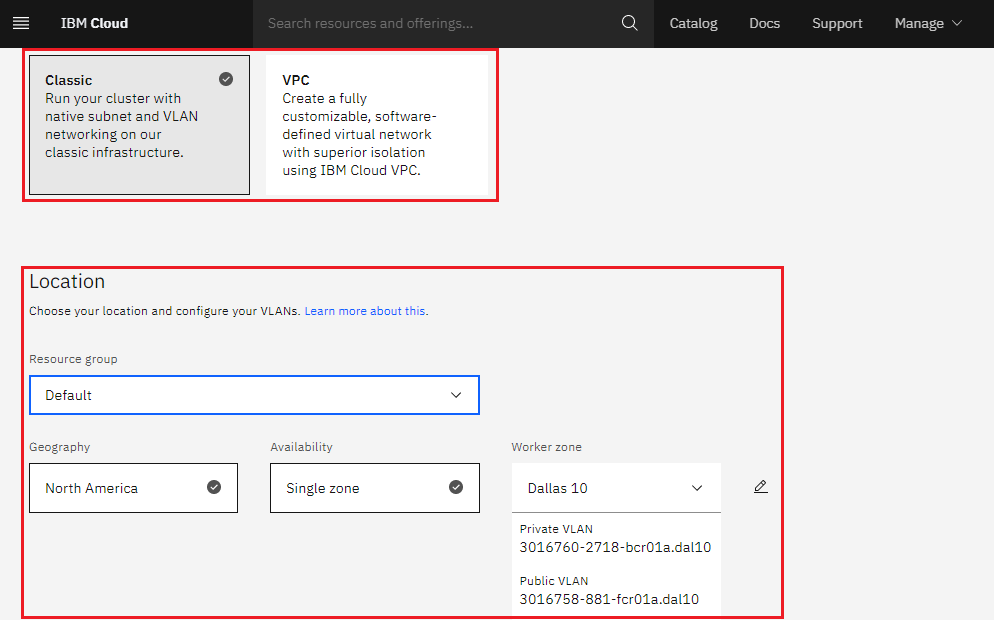
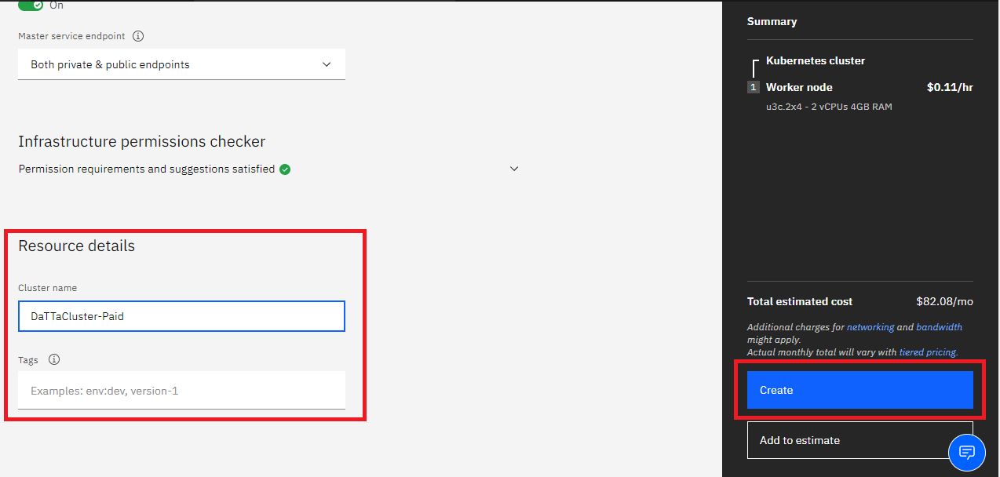
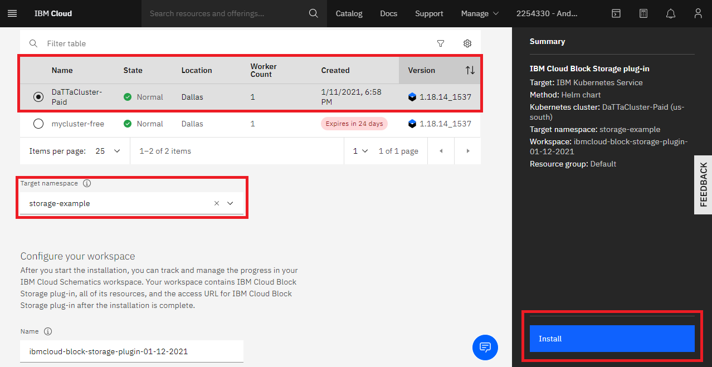
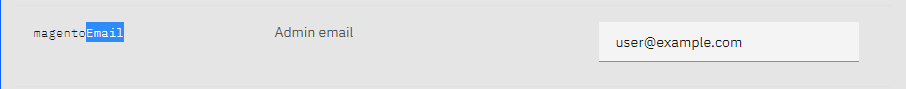
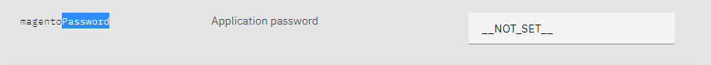
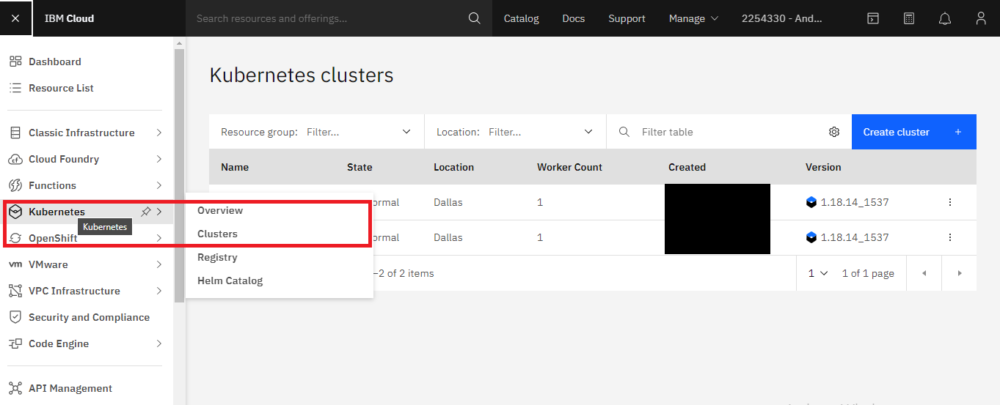
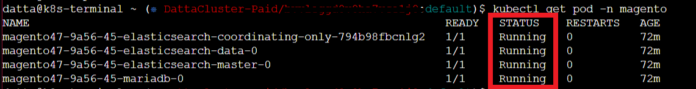
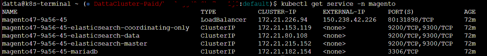
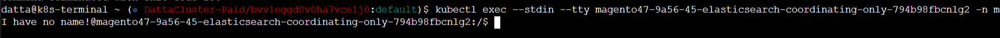

# Install Magento in IBM Cloud

Would you like to create your own e-commerce with Magento using the IBM Cloud? This documentation will guide you on how to install Magento on the IBM Cloud using the Kubernetes Service. Simple and effective.

## Pre-requisites

You must have an account created in IBM Cloud. The account needs to be either be *Pay-As-You-Go* or *Subscription*. Click [here](https://cloud.ibm.com/docs/account?topic=account-accounts "here") to read more.
If you have a Lite account, you can upgrade it. Click [here](https://cloud.ibm.com/docs/account?topic=account-account-getting-started#account-gs-upgrade "here") to learn how to upgrade.

## Step 1: Provision Kubernetes Cluster

* Click on the search section at the top of the main page, type Kubernetes, and then choose Kubernetes Service.

* In the new window, select between the free and standard type under "Pricing plan". Once selected, click on create.

We'll choose the Standard Plan for this documentation as the Free Plan may fall short of resources when deploying your pods. We highly recommend using a Standard Plan with the hardware that suits you the best. If you're selecting the Standard Plan, please make sure you select the adequate requirements,

* Select your Kubernetes Version to be the latest available or the required one by your application. In this example, we have set it to be '1.18.13'.
* Select Infrastructure as 'Classic'.
* Leave Resource Group to 'Default'.
* Select Geography to the one that suits you better or that fits your infrastructure.
* Select Availability to be 'Single Zone' or 'Multi Zone' depending on your needs.
* Select a Worker Zone that suits you better or that fits your infrastructure.

* Select the number of workers in Worker Pool.
* Give your Worker Pool a name.
* Leave the Encrypt Local Disk option 'On'
* Choose 'Both private and public endpoints' on Master Service Endpoint

* Give your cluster a name in 'cluster-name'
* Provide the tags to your cluster and click on Create.

Wait a few minutes while your cluster is deployed.

The following checkmark and the word 'normal' will appear once the Kubernetes Cluster is deployed. You can check it under your cluster section which is located in your *Resources List*.

## Step 2:  Deploy IBM Cloud Block Storage plug-in

* Click on the search section at the top of the main page, select IBM Cloud Block Storage, and click on it.

* A new window opens, select the cluster and enter the name you want for this workspace, in this case, it will be called _storage-example_, accept the terms, click *Install* and wait a few minutes.

## Step 3: Install Magento

* Click on the search section at the top of the main page, type Magento, and click on it.

* A new window opens, select the cluster and enter the name you want for the Magento workspace, in this case, it will be called _magento-example_; then, go to the bottom to find the workspace parameters.

You can modify the different installation parameters at the bottom. We will leave them by default except for the credentials Magento uses for its database and its application. You will need the first to access your database console and the second one to access your new Magento application. You can read more about setting up the parameters [here](https://cloud.ibm.com/catalog/content/prestashop "here").

Make sure you set up correctly the email and password for the application in the _magentoEmail_ and _magentoPassword_ variables. 

The admin user will be _root_ by default, and you can change its password in the _mariadb.auth.rootPassword_.

When you're done, accept the terms, and click on *Install*.

## Step 4: Verify Installation

* Go to *Resources List* in the Left Navigation Menu and click on *Kubernetes*.

* Click the *Actions* button and select *Web terminal*.

* A window opens to install the web terminal, click on install and wait a few minutes. The window will pop up at the buttom If the web terminal is already installed.

* Once you have installed the terminal, open it, select web terminal, and type the following command. It will show you the workspaces of your cluster. You can see *magento-example* is now active.

`$ kubectl get ns`

* You can then obtain more data about the service and it's pods.

`$ kubectl get pod -n NAMESERVICE -o wide`

* You can know enter the application and its sample website by accessing the External IP.

`$ kubectl get service -n NAME SERVICE`

* Select the pod within your service using bash so you can start interacting with the Magento system files and console from the terminal.

`$ kubectl exec --stdin --tty PODNAME -n NAMESPACE -- /bin/bash`

You have finished the installation, enjoy your Magento installation and start building your e-commerce!
